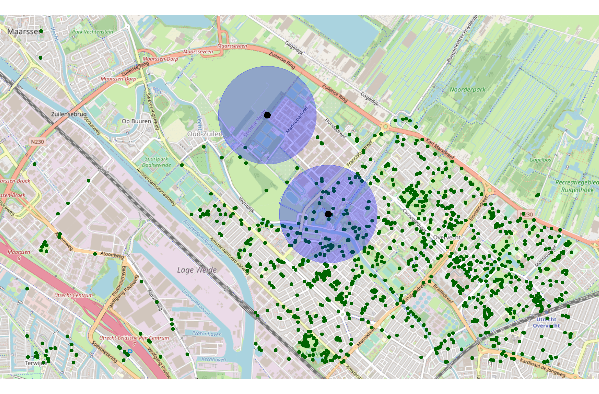

<p align="center">
  </img>
  <!-- badges: start
  <br/>
  <span>
    <a href="https://travis-ci.org/vankesteren/tensorsem"></img></a>
    <a href="https://zenodo.org/badge/latestdoi/168356695"></a>
    [](https://github.com/sodascience/osmenrich/actions)
    [](https://codecov.io/gh/sodascience/osmenrich?branch=master)
  </span>
  badges: end -->
</p>
<br/>

# Enrich geocoded data using OpenStreetMap

 [](https://zenodo.org/badge/latestdoi/337555188)

The goal of `osmenrich` is to easily enrich geocoded data
(`latitude`/`longitude`) with geographic features from OpenStreetMap (OSM).
The main language of the package is `R` and this package is designed to work
with the [`sf`](https://r-spatial.github.io/sf/) and [`osmdata`](
https://cran.r-project.org/web/packages/osmdata/vignettes/osmdata.html)
packages for collecting and manipulating geodata.

## Installation

To install the package, you first need to have the `remotes` package installed.
If you do not have this package yet, please install it first with:

```r
install.packages("remotes")
```

If you do have this package, due to recent changes in GitHub's naming of branches,
please make sure you have the latest version of `remotes` or at least version
`2.2`.

Once you did this, to continue the installation of the `osmenrich` package, run:

```r
remotes::install_github("sodascience/osmenrich@main")
```

or, for the development version, run:

```r
remotes::install_github("sodascience/osmenrich@develop")
```

This will use the default public APIs for OSM data and routing (for computing
driving/walking distances and durations). __Do not use `osmenrich` with
default APIs for large datasets!__ If you want to learn how to use `osmenrich`
for large queries follow the instructions in section
[Local API Setup](#local-api-setup) below.

## Usage

### Simple enrichment example

Let's enrich a spatial (`sf`) dataset (`sf_example`) with the number of waste
baskets in a radius of 500 meters from each of the point specified in a
dataset:

```r
# Import libraries
library(tidyverse)
library(sf)
library(osmenrich)

# Create an example dataset to enrich
sf_example <-
  tribble(
    ~person,  ~lat,   ~lon,
    "Alice",  52.12,  5.09,
    "Bob",    52.13,  5.08,
  ) %>%
  sf::st_as_sf(
    coords = c("lon", "lat"),
    crs = 4326
  )

# Print it
sf_example
#> Simple feature collection with 2 features and 1 field
#> geometry type:  POINT
#> dimension:      XY
#> bbox:           xmin: 5.08 ymin: 52.12 xmax: 5.09 ymax: 52.13
#> CRS:            EPSG:4326
#> # A tibble: 2 x 2
#>   person     geometry
#> * <chr>   <POINT [°]>
#> 1 Alice  (5.09 52.12)
#> 2 Bob    (5.08 52.13)
```

To enrich the `sf_example` dataset with "waste baskets" in a 500m radius, you
can create a query using the `enrich_osm()` function. This function uses the
bounding box created by the points present in the example dataset and searches
for the specified `key = "amenity"` and `value = "waste_basket`. You can also add a
custom `name` for the newly created column and specify the radius (`r`) used
in the search. See
[Map Features on the website of OSM](https://wiki.openstreetmap.org/wiki/Map_features)
for a complete list of `key` and `value` combinations.

```r
# Simple OSMEnrich query
sf_example_enriched <- sf_example %>%
  enrich_osm(
    name = "n_waste_baskets",
    key = "amenity",
    value = "waste_basket",
    r = 500
  )
#> Downloading data for waste_baskets... Done.
#> Downloaded 147 points, 0 lines, 0 polygons, 0 mlines, 0 mpolygons.
#> Computing distance matrix for n_waste_baskets...Done.
```

The resulting enriched dataset `sf_example_enriched` is a `sf` object and can be printed as usual
to inspect the newly added column `n_waste_baskets`.

```r
sf_example_enriched
#> Simple feature collection with 2 features and 2 fields
#> geometry type:  POINT
#> dimension:      XY
#> bbox:           xmin: 5.08 ymin: 52.12 xmax: 5.09 ymax: 52.13
#> geographic CRS: WGS 84
#> # A tibble: 2 x 3
#>   person     geometry n_waste_baskets
#> * <chr>   <POINT [°]>         <int>
#> 1 Alice  (5.09 52.12)            75
#> 2 Bob    (5.08 52.13)             1
```

The waste baskets column is now the result of summing all the wastebaskets in a 500 meter radius for Alice and Bob:


## Local API setup

OSM enrichment can ask for a lot of data, which can overload public APIs. If
you intend to enrich large amounts of data or compute routing distances (e.g.,
driving duration) between many points, you should set up a local API endpoint.

Multiple `docker-compose` workflows for doing this are avaialble in the separate
[osmenrich_docker
repository](https://github.com/sodascience/osmenrich_docker). Use the `README`
in the repository to select the workflow that fits your desired outcome.

</img>

<!-- CONTRIBUTING -->
## Contributing

Contributions are what make the open source community an amazing place to
learn, inspire, and create. Any contributions you make are **greatly
appreciated**.

In this project, the [Gitflow workflow](https://nvie.com/posts/a-successful-git-branching-model/)
is used. Instead of having a single `main`
branch, the project makes use of two branches to record the history of the
project: `develop` and `main`. The `main` branch is used only for the
official releases of the project, while the `develop` branch is used to
integrate the new features developed. Finally, `feature` branches are used to
develop new features or additions to the project that will be `rebased and squashed`
in the `develop` branch.

The workflow to contribute with Gitflow becomes:

1. Fork the Project
2. Create your Feature Branch (`git checkout -b feature/<AmazingFeature>`)
3. Commit your Changes (`git commit -m 'Add some <AmazingFeature>'`)
4. Push to the Branch (`git push origin feature/<AmazingFeature>`)
5. Open a Pull Request

## License and citation

The `osmenrich` package is published under the MIT license. When using
`osmenrich` for academic work, please cite:

```
van Kesteren, Erik-Jan, Vida, Leonardo, de Bruin, Jonathan, & Oberski, Daniel. (2021, February 11).
Enrich sf Data with Geographic Features from OpenStreetMaps (Version v1.0). Zenodo. http://doi.org/10.5281/zenodo.4534188
```

<!-- CONTACT -->
## Contact

This package is developed and maintained by the [ODISSEI Social Data Science
(SoDa)](https://odissei-data.nl/nl/soda/) team.

Do you have questions, suggestions, or remarks? File an issue in the issue
tracker or feel free to contact [Erik-Jan van
Kesteren](https://github.com/vankesteren)
([@ejvankesteren](https://twitter.com/ejvankesteren)) or [Leonardo
Vida](https://github.com/leonardovida)
([@leonardojvida](https://twitter.com/leonardojvida))

</img>
